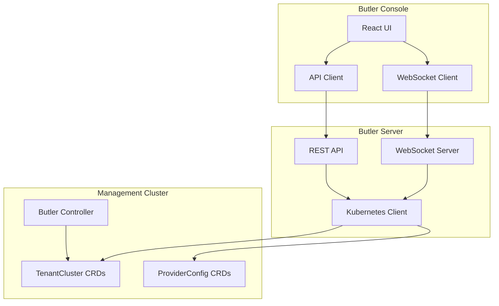
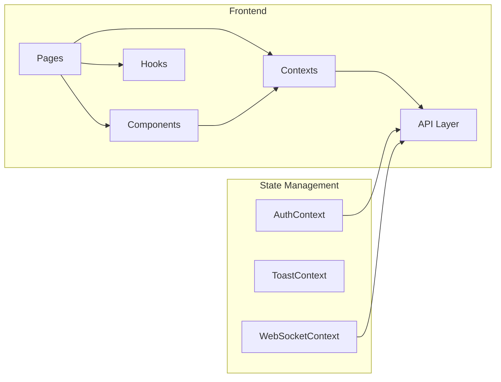
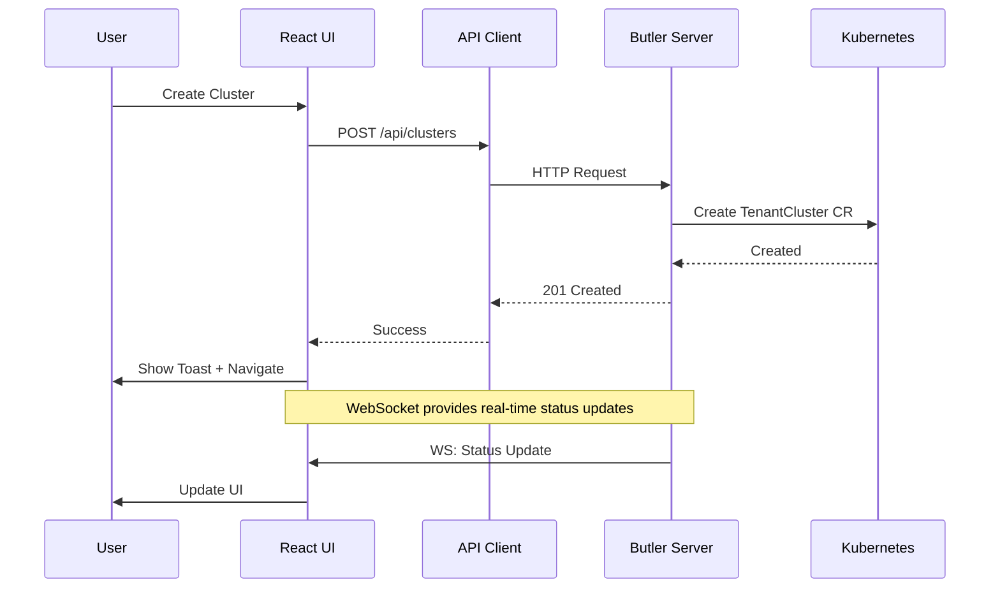

# Butler Console

A modern web interface for managing Kubernetes clusters provisioned by Butler. Built with React, TypeScript, and Tailwind CSS.

## Table of Contents

- [Overview](#overview)
- [Features](#features)
- [Architecture](#architecture)
- [Tech Stack](#tech-stack)
- [Project Structure](#project-structure)
- [Getting Started](#getting-started)
  - [Prerequisites](#prerequisites)
  - [Installation](#installation)
  - [Development](#development)
  - [Building](#building)
- [Configuration](#configuration)
- [API Integration](#api-integration)
- [Deployment](#deployment)
- [Contributing](#contributing)
- [License](#license)

## Overview

Butler Console provides a unified interface for platform engineers to manage their Kubernetes infrastructure. It connects to the Butler Server API to provision tenant clusters, manage infrastructure providers, install addons, and monitor cluster health.



## Features

| Feature | Description |
|---------|-------------|
| **Dashboard** | Overview of cluster health, status counts, and recent activity |
| **Cluster Management** | Create, view, and delete tenant Kubernetes clusters |
| **Provider Configuration** | Configure Harvester, Nutanix, and Proxmox infrastructure providers |
| **Addon Marketplace** | Browse, install, and manage cluster addons with GitOps support |
| **Web Terminal** | Interactive kubectl access to management and tenant clusters |
| **Real-time Updates** | WebSocket-powered live status updates |
| **Dark Theme** | Modern dark UI optimized for platform engineering workflows |

## Architecture



### Data Flow



## Tech Stack

| Category | Technology |
|----------|------------|
| Framework | React 18 |
| Language | TypeScript |
| Styling | Tailwind CSS |
| Build Tool | Vite |
| Routing | React Router v6 |
| Animation | Framer Motion |
| Terminal | xterm.js |
| HTTP Client | Fetch API |
| Icons | Heroicons (inline SVG) |

## Project Structure

```
butler-console/
├── src/
│   ├── api/                    # API client modules
│   │   ├── client.ts           # Base HTTP client with auth
│   │   ├── auth.ts             # Authentication endpoints
│   │   ├── clusters.ts         # Cluster management endpoints
│   │   ├── providers.ts        # Provider configuration endpoints
│   │   ├── addons.ts           # Addon catalog and installation
│   │   └── index.ts            # API exports
│   │
│   ├── components/
│   │   ├── ui/                 # Reusable UI primitives
│   │   │   ├── Button.tsx
│   │   │   ├── Card.tsx
│   │   │   ├── Input.tsx
│   │   │   ├── Modal.tsx
│   │   │   ├── Spinner.tsx
│   │   │   ├── StatusBadge.tsx
│   │   │   ├── FadeIn.tsx
│   │   │   ├── EmptyState.tsx
│   │   │   └── index.ts
│   │   │
│   │   ├── layout/             # App shell components
│   │   │   ├── Layout.tsx
│   │   │   ├── Sidebar.tsx
│   │   │   ├── Header.tsx
│   │   │   └── index.ts
│   │   │
│   │   ├── clusters/           # Cluster-specific components
│   │   │   ├── AddonsTab.tsx
│   │   │   ├── DeleteClusterModal.tsx
│   │   │   └── index.ts
│   │   │
│   │   ├── management/         # Management cluster components
│   │   │   ├── ManagementAddonsTab.tsx
│   │   │   └── index.ts
│   │   │
│   │   └── terminal/           # Terminal components
│   │       ├── ClusterTerminal.tsx
│   │       └── index.ts
│   │
│   ├── contexts/               # React contexts for global state
│   │   ├── AuthContext.tsx     # Authentication state
│   │   ├── ToastContext.tsx    # Toast notifications
│   │   ├── WebSocketContext.tsx # Real-time connection
│   │   └── index.ts
│   │
│   ├── hooks/                  # Custom React hooks
│   │   ├── useDocumentTitle.ts
│   │   └── index.ts
│   │
│   ├── lib/                    # Utility functions
│   │   └── utils.ts            # cn() classname helper
│   │
│   ├── pages/                  # Route page components
│   │   ├── LoginPage.tsx
│   │   ├── DashboardPage.tsx
│   │   ├── ManagementPage.tsx
│   │   ├── ClustersPage.tsx
│   │   ├── ClusterDetailPage.tsx
│   │   ├── CreateClusterPage.tsx
│   │   ├── ProvidersPage.tsx
│   │   ├── CreateProviderPage.tsx
│   │   ├── SettingsPage.tsx
│   │   ├── TerminalPage.tsx
│   │   └── index.ts
│   │
│   ├── App.tsx                 # Root component with routing
│   ├── main.tsx                # Application entry point
│   └── index.css               # Global styles and Tailwind
│
├── public/
│   ├── butlerlabs.svg          # Logo
│   └── butlergopher.png        # Watermark
│
├── Dockerfile                  # Multi-stage production build
├── nginx.conf                  # Nginx configuration for SPA
├── package.json
├── tsconfig.json
├── tsconfig.app.json
├── tsconfig.node.json
├── vite.config.ts
└── tailwind.config.ts
```

## Getting Started

### Prerequisites

- Node.js 20+
- npm or yarn
- Butler Server running (for API connectivity)

### Installation

```bash
# Clone the repository
git clone https://github.com/butlerdotdev/butler-console.git
cd butler-console

# Install dependencies
npm install
```

### Development

```bash
# Start development server
npm run dev

# The console will be available at http://localhost:5173
# API requests proxy to http://localhost:8080 (Butler Server)
```

### Building

```bash
# Build for production
npm run build

# Preview production build
npm run preview

# Type checking
npm run typecheck

# Linting
npm run lint
```

## Configuration

### Vite Development Proxy

The development server proxies API requests to the Butler Server:

```typescript
// vite.config.ts
export default defineConfig({
  server: {
    proxy: {
      '/api': 'http://localhost:8080',
      '/ws': {
        target: 'ws://localhost:8080',
        ws: true,
      },
    },
  },
})
```

### Environment Variables

| Variable | Description | Default |
|----------|-------------|---------|
| `VITE_API_URL` | Butler Server API URL | `/api` (proxied) |

## API Integration

The console communicates with Butler Server through a typed API client:

```typescript
// Example: Creating a cluster
import { clustersApi } from '@/api'

const cluster = await clustersApi.create({
  name: 'my-cluster',
  namespace: 'butler-tenants',
  kubernetesVersion: 'v1.30.2',
  providerConfigRef: 'harvester-prod',
  workerReplicas: 3,
  workerCPU: 4,
  workerMemory: '8Gi',
  loadBalancerStart: '10.40.1.100',
  loadBalancerEnd: '10.40.1.150',
})
```

### API Modules

| Module | Endpoints |
|--------|-----------|
| `auth` | Login, logout, token refresh |
| `clusters` | CRUD operations, nodes, events, kubeconfig |
| `providers` | Provider configuration and validation |
| `addons` | Catalog, installation, management |

## Deployment

### Docker

```bash
# Build the image
docker build -t butler-console:latest .

# Run the container
docker run -p 80:80 butler-console:latest
```

### Kubernetes (via Butler Server)

The console is embedded in Butler Server and served automatically. For standalone deployment:

```yaml
apiVersion: apps/v1
kind: Deployment
metadata:
  name: butler-console
spec:
  replicas: 2
  selector:
    matchLabels:
      app: butler-console
  template:
    metadata:
      labels:
        app: butler-console
    spec:
      containers:
        - name: console
          image: ghcr.io/butlerdotdev/butler-console:latest
          ports:
            - containerPort: 80
          resources:
            requests:
              memory: "64Mi"
              cpu: "50m"
            limits:
              memory: "128Mi"
              cpu: "100m"
```

## Contributing

We welcome contributions! Please see our [Contributing Guide](../CONTRIBUTING.md) for details.

### Development Workflow

1. Fork the repository
2. Create a feature branch (`git checkout -b feature/amazing-feature`)
3. Make your changes
4. Run tests and linting (`npm run lint && npm run typecheck`)
5. Commit with conventional commits (`git commit -m 'feat: add amazing feature'`)
6. Push to your fork (`git push origin feature/amazing-feature`)
7. Open a Pull Request

### Code Style

- TypeScript strict mode enabled
- Functional components with hooks
- Tailwind CSS for styling (no CSS modules)
- Apache 2.0 license headers on all source files

## License

Copyright 2025 The Butler Authors.

Licensed under the Apache License, Version 2.0. See [LICENSE](../LICENSE) for details.

---

<p align="center">
  <a href="https://butlerlabs.dev">Butler Labs</a> •
  <a href="https://github.com/butlerdotdev">GitHub</a> •
  <a href="https://docs.butlerlabs.dev">Documentation</a>
</p>
